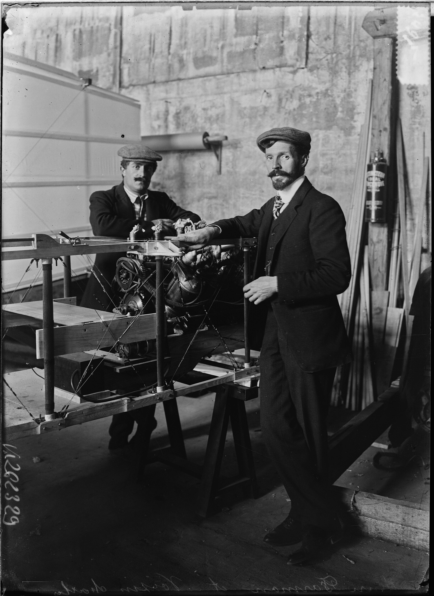

# Pool de artículos reservados para próximos números

Artículos ya redactados (FR/ES) que se retiraron de una edición para publicarse más adelante.
Al usarlos: pegar el bloque HTML en `secondary-articles`, añadir la entrada al Sumario/Sommaire y comprobar que la imagen sigue en `news/`.

---

## Le kilomètre se joue dans le virage / El kilómetro se juega en el viraje

- **Reservado para**: una edición posterior al 20 de noviembre de 1907 (retirado de `noticias36.html`, donde se publicó en su lugar «Los bailarines que cruzan Europa»).
- **Firma**: É. Garnier
- **Imagen**: `news/voisin_farman_atelier_1907.jpg` (ya en el repo — Charles Voisin y Henri Farman junto al bastidor y el motor de un biplano, agencia Rol, 1907, dominio público, BnF).
- **Entrada de sumario FR**: `Le kilomètre se joue dans le virage : É. Garnier`
- **Entrada de sumario ES**: `El kilómetro se juega en el viraje : É. Garnier`
- **Nota de continuidad**: continúa «Farman roule vers le kilomètre» (`noticias35.html`, 18 nov 1907). Dice «hace diez días» por el vuelo de más de mil metros en recta y sitúa la escena «martes»; si se publica bastante más tarde, ajustar esas referencias. El premio Deutsch-Archdeacon sigue sin ganarse mientras no se cierre el kilómetro en circuito.

```html
<article class="secondary-article">
    <h3 class="secondary-title lang-fr">Le kilomètre se joue dans le virage</h3>
    <h3 class="secondary-title lang-es">El kilómetro se juega en el viraje</h3>
    <div class="article-image" style="aspect-ratio: 4 / 3;">
        
    </div>
    <div class="secondary-text lang-fr">
        <p>Issy-les-Moulineaux, mardi — Le champ était gelé dur et les chronométreurs de l'Aéro-Club soufflaient dans leurs gants. On sait ce qui se joue : cinquante mille francs au premier kilomètre en circuit fermé. Ce que l'on sait moins, et que cette rédaction a mis quelque temps à comprendre, c'est que la difficulté n'est plus la distance. Elle est le virage.</p>
        <p>M. Henri Farman a couvert, il y a dix jours, plus de mille mètres en ligne droite, et personne n'en doute plus. Mais le prix ne se gagne pas en ligne droite : il faut partir d'un poteau, en contourner un second et revenir, ce qui fait un kilomètre et une courbe. Or la machine de MM. Voisin, qui tient l'air avec une stabilité de bouée, s'entête à aller devant elle. « Ce qui la rend sûre en ligne droite la rend têtue en courbe », résume un mécanicien de Billancourt, où l'on lime, recolle et retend depuis trois semaines. On y parle du gouvernail comme d'un homme à convaincre.</p>
        <p>M. Léon Delagrange, sur une machine sœur, s'exerce au même problème avec une courtoisie parfaite : les deux équipes se prêtent des outils et se cachent leurs chiffres. On rappelle, dans les hangars, que les frères Wright tournent en Amérique depuis des années et ne montrent rien ; l'un d'eux a passé l'automne à Paris à discuter des contrats sans ouvrir une seule caisse. Cinquante chevaux, du bois, de la toile et de l'acier : les ingénieurs répètent qu'il n'y a là-dedans aucun mystère, et ils le répètent un peu plus fort qu'il ne serait nécessaire.</p>
        <p>Au bord du champ, on a revu ces messieurs que l'on dit du métier des arts. L'un d'eux, que l'on assure du Conseil des Beaux-Arts, a demandé à un ingénieur si une machine qui vole relevait des arts. L'ingénieur a répondu que non, et l'on a ri : par les temps qui courent, c'est presque une déclaration. Le siècle, à ce qu'il paraît, aura deux sortes de prodiges, et l'une d'elles se fabriquera à l'atelier, en série, avec un devis.</p>
        <p>Le kilomètre viendra, disent les mécaniciens ; il ne demande qu'un virage et un peu de patience. On souhaite qu'il vienne, et qu'il ne demande rien d'autre.</p>
        <p style="text-align: right; font-style: italic;">É. Garnier</p>
    </div>
    <div class="secondary-text lang-es">
        <p>Issy-les-Moulineaux, martes — El campo estaba helado y los cronometradores del Aéro-Club se soplaban los guantes. Se sabe lo que está en juego: cincuenta mil francos al primer kilómetro en circuito cerrado. Lo que se sabe menos, y que a esta redacción le ha costado un rato entender, es que la dificultad ya no es la distancia. Es el viraje.</p>
        <p>El señor Henri Farman cubrió, hace diez días, más de mil metros en línea recta, y nadie lo pone ya en duda. Pero el premio no se gana en línea recta: hay que partir de un poste, rodear un segundo y volver, lo que hace un kilómetro y una curva. Y la máquina de los señores Voisin, que se sostiene en el aire con una estabilidad de boya, se empeña en ir hacia adelante. «Lo que la hace segura en recta la hace testaruda en curva», resume un mecánico de Billancourt, donde se lima, se encola y se retensa desde hace tres semanas. Allí se habla del timón como de un hombre al que hay que convencer.</p>
        <p>El señor Léon Delagrange, sobre una máquina hermana, se ejercita en el mismo problema con una cortesía perfecta: los dos equipos se prestan herramientas y se ocultan las cifras. Se recuerda, en los cobertizos, que los hermanos Wright vuelan en América desde hace años y no enseñan nada; uno de ellos ha pasado el otoño en París discutiendo contratos sin abrir una sola caja. Cincuenta caballos, madera, tela y acero: los ingenieros repiten que ahí dentro no hay misterio alguno, y lo repiten algo más alto de lo necesario.</p>
        <p>Al borde del campo se ha vuelto a ver a esos señores que se dicen del oficio de las artes. Uno de ellos, a quien aseguran del Consejo de Bellas Artes, preguntó a un ingeniero si una máquina que vuela pertenecía a las artes. El ingeniero respondió que no, y hubo risas: en los tiempos que corren, eso es casi una declaración. El siglo, por lo visto, tendrá dos clases de prodigios, y una de ellas se fabricará en el taller, en serie, con presupuesto.</p>
        <p>El kilómetro llegará, dicen los mecánicos; no pide más que un viraje y un poco de paciencia. Ojalá llegue, y ojalá no pida nada más.</p>
        <p style="text-align: right; font-style: italic;">É. Garnier</p>
    </div>
</article>
```
