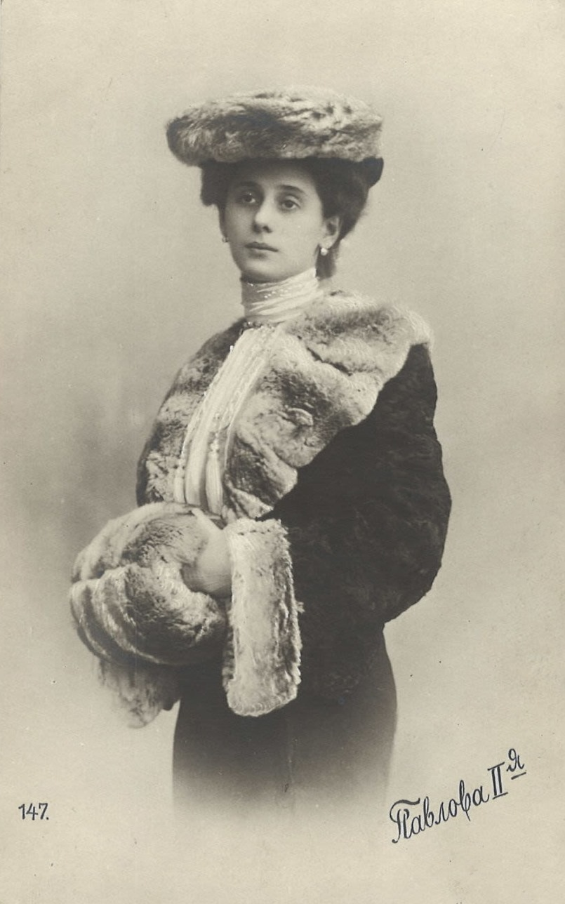

# Pool de artículos reservados para próximos números

Artículos ya redactados (FR/ES) que se retiraron de una edición para publicarse más adelante.
Al usarlos: pegar el bloque HTML en `secondary-articles`, añadir la entrada al Sumario/Sommaire y comprobar que la imagen sigue en `news/`.

---

## Los bailarines que cruzan Europa / Les danseurs qui traversent l'Europe

- **Reservado para**: el número siguiente al 18 de noviembre de 1907 (retirado de `noticias35.html`).
- **Firma**: H. Dubois
- **Imagen**: `news/pavlova_1905.jpg` (ya en el repo — retrato de bailarina rusa con pieles, tarjeta postal de San Petersburgo hacia 1905, dominio público).
- **Entrada de sumario FR**: `Les danseurs qui traversent l'Europe : H. Dubois`
- **Entrada de sumario ES**: `Los bailarines que cruzan Europa : H. Dubois`
- **Nota de continuidad**: menciona la «temporada rusa» de Diaghilew en preparación y el éxodo de artistas rusos; si al publicarlo han pasado días, cambiar «la semaine passée / la semana pasada» si hiciera falta.

```html
<article class="secondary-article">
    <h3 class="secondary-title lang-fr">Les danseurs qui traversent l'Europe</h3>
    <h3 class="secondary-title lang-es">Los bailarines que cruzan Europa</h3>
    <div class="article-image">
        
    </div>
    <div class="secondary-text lang-fr">
        <p>Gare du Nord, chaque semaine — De l'express de Cologne descendent des voyageurs aux valises légères et aux noms difficiles : danseurs, musiciens, peintres de décors. Ils laissent derrière eux la Russie du Tsar, devenue caserne, où les théâtres ferment plus vite que les forteresses ne s'ouvrent, et où l'on mobilise jusqu'aux orchestres.</p>
        <p>Leurs papiers disent « choristes ». À Saint-Pétersbourg, on les tient pour des déserteurs — car la désertion, depuis que la Russie marche, atteint aussi les théâtres. Une première danseuse des scènes impériales est arrivée la semaine passée, dit-on, les pieds bandés et le port intact ; elle a demandé, dans un français d'école, où l'on trouvait à Paris un plancher qui ne fût pas un quai de gare.</p>
        <p>M. Serge de Diaghilew, que l'on connaît ici depuis ses concerts russes du printemps dernier, réunit ce monde dispersé et prépare pour la belle saison une « saison russe » complète : ballet, opéra, décors et costumes. « La Russie exporte à présent la seule chose qui lui reste en excédent, » dit-il à qui veut l'entendre : « du talent. »</p>
        <p>À la douane, conte un porteur, la malle d'un maître de ballet pesait davantage qu'elle n'eût dû ; on ne l'ouvrit point, les papiers étant en règle, et cette rédaction n'y veut voir que le poids des souvenirs. Paris, qui accueille déjà ceux du sud, fera place à ceux de l'est : il n'a jamais su résister aux gens qui arrivent en fuyant et en dansant.</p>
        <p style="text-align: right; font-style: italic;">H. Dubois</p>
    </div>
    <div class="secondary-text lang-es">
        <p>Gare du Nord, cada semana — Del expreso de Colonia bajan viajeros de maletas ligeras y apellidos difíciles: bailarines, músicos, pintores de decorados. Dejan atrás la Rusia del Zar, convertida en cuartel, donde los teatros cierran más deprisa de lo que se abren las fortalezas y donde se moviliza hasta a las orquestas.</p>
        <p>Sus papeles dicen «coristas». En San Petersburgo se les tiene por desertores — porque la deserción, desde que Rusia marcha, alcanza también a los teatros. Una primera bailarina de los escenarios imperiales llegó la semana pasada, según se cuenta, con los pies vendados y el porte intacto; preguntó, en un francés de escuela, dónde se encontraba en París un entarimado que no fuese un andén de estación.</p>
        <p>El señor Sergio de Diaghilew, a quien aquí se conoce desde sus conciertos rusos de la primavera pasada, va reuniendo a ese mundo disperso y prepara para la buena estación una «temporada rusa» completa: ballet, ópera, decorados y vestuario. «Rusia exporta ahora lo único que le sobra», dice a quien quiera oírle: «talento.»</p>
        <p>En la aduana, cuenta un mozo, el baúl de un maestro de ballet pesaba más de lo que debiera; no se abrió, porque los papeles estaban en regla, y esta redacción no quiere ver en ello más que el peso de los recuerdos. París, que ya acoge a los del sur, hará sitio a los del este: nunca ha sabido resistirse a la gente que llega huyendo y bailando.</p>
        <p style="text-align: right; font-style: italic;">H. Dubois</p>
    </div>
</article>
```
