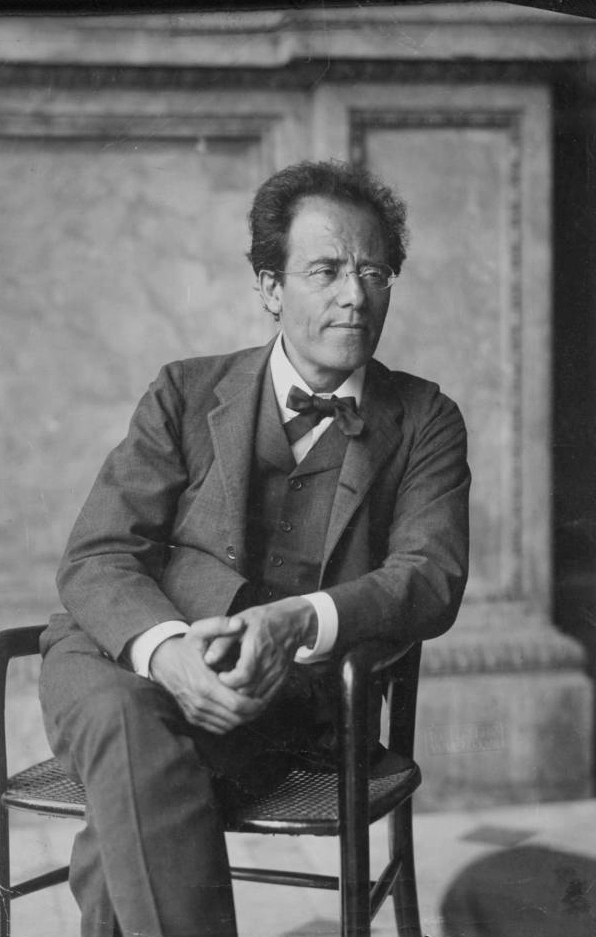

# Pool de artículos reservados para próximos números

Artículos ya redactados (FR/ES) que se retiraron de una edición para publicarse más adelante.
Al usarlos: pegar el bloque HTML en `secondary-articles`, añadir la entrada al Sumario/Sommaire y comprobar que la imagen sigue en `news/`.

---

## Vienne perd sa baguette / Viena pierde su batuta

- **Reservado para**: una edición posterior al 22 de noviembre de 1907 (retirado de `noticias37.html`, donde se publicó en su lugar «Petit traité de l'élection» de L. Roy).
- **Firma**: L. Martin
- **Formato**: artículo de la columna derecha (`sidebar-article`, retrato 3:4).
- **Imagen**: `news/mahler_nahr_1907.jpg` (ya en el repo — Gustav Mahler en la Ópera de la Corte de Viena, 1907, fotografía de Moritz Nähr, dominio público).
- **Entrada de sumario FR**: `Vienne perd sa baguette : L. Martin`
- **Entrada de sumario ES**: `Viena pierde su batuta : L. Martin`
- **Nota de continuidad**: anuncia para «el domingo» el concierto de despedida de Mahler en el Musikverein (histórico: 24 nov 1907, Segunda Sinfonía) y su embarque en diciembre hacia el Metropolitan. Si se publica después del 24 nov, reescribir en pasado (el concierto ya se dio; histórico: salió de la Westbahnhof de Viena el 9 dic 1907, despedido por unas doscientas personas, Klimt entre ellas). Weingartner le sucede el 1 ene 1908. Guiño de canon: «tres veces apátrida… los mapas, desde hace dos años, le han dado la razón en lo primero» (secesión de Bohemia, 1905).

```html
                <article class="sidebar-article">
                    <h3 class="sidebar-title lang-fr">Vienne perd sa baguette</h3>
                    <h3 class="sidebar-title lang-es">Viena pierde su batuta</h3>
                    <div class="vertical-image sidebar-portrait" style="margin-bottom: 1em;">
                        
                    </div>
                    <div class="sidebar-text lang-fr">
                        <p>Dimanche, dans la grande salle du Musikverein, M. Gustav Mahler dirigera sa deuxième symphonie, que l'on appelle « Résurrection », et ce sera pour dire adieu à Vienne. Après dix ans à la tête de l'Opéra de la Cour, le compositeur a remis sa démission ; M. Felix Weingartner lui succède au premier janvier, et M. Mahler s'embarquera en décembre pour New-York, où le Metropolitan Opera l'attend pour la saison.</p>
                        <p>Dix ans lui ont suffi pour faire de la maison de la Ringstrasse la première scène lyrique d'Europe, et pour s'y faire autant d'ennemis qu'elle comptait d'abonnés. On lui reprochait les retardataires refoulés à la porte, la salle plongée dans le noir, la claque congédiée, les chanteurs contraints de répéter comme des débutants. Une certaine presse viennoise, qui ne lui a jamais rien pardonné — pas même sa naissance —, le poursuivait depuis des années ; elle a fini par l'emporter, et se demande à présent qui elle attaquera.</p>
                        <p>M. Mahler aime à dire qu'il est trois fois sans patrie : Bohémien parmi les Autrichiens, Autrichien parmi les Allemands, Juif parmi tous les peuples du monde. Les cartes, depuis deux ans, lui ont donné raison sur le premier point.</p>
                        <p>Ceux qui assistèrent le 15 octobre à son dernier <em>Fidelio</em> assurent que la salle ne toussa pas une seule fois en trois heures, ce qui, à Vienne, en octobre, tient de l'exploit. Nous n'y voyons qu'un effet de la discipline. Vienne perd son chef ; New-York gagne un homme qui ne supporte ni le retard ni la toux. L'Amérique a de l'argent : elle va découvrir qu'il faut aussi du silence.</p>
                        <p style="text-align: right; font-style: italic;">L. Martin</p>
                    </div>
                    <div class="sidebar-text lang-es">
                        <p>El domingo, en la gran sala del Musikverein, el señor Gustav Mahler dirigirá su segunda sinfonía, a la que llaman «Resurrección», y será para despedirse de Viena. Tras diez años al frente de la Ópera de la Corte, el compositor ha presentado su dimisión; el señor Felix Weingartner le sucede el primero de enero, y el señor Mahler embarcará en diciembre rumbo a Nueva York, donde la Metropolitan Opera le espera para la temporada.</p>
                        <p>Diez años le han bastado para hacer de la casa de la Ringstrasse el primer escenario lírico de Europa, y para ganarse en ella tantos enemigos como abonados tenía. Se le reprochaban los rezagados rechazados en la puerta, la sala sumida en la oscuridad, la claque despedida, los cantantes obligados a ensayar como principiantes. Cierta prensa vienesa, que nunca le ha perdonado nada —ni siquiera su origen—, le perseguía desde hacía años; ha acabado saliéndose con la suya, y se pregunta ahora a quién atacará.</p>
                        <p>Al señor Mahler le gusta decir que es tres veces apátrida: bohemio entre los austríacos, austríaco entre los alemanes, judío entre todos los pueblos del mundo. Los mapas, desde hace dos años, le han dado la razón en lo primero.</p>
                        <p>Quienes asistieron el 15 de octubre a su último <em>Fidelio</em> aseguran que la sala no tosió ni una sola vez en tres horas, lo que en Viena, en octubre, tiene algo de hazaña. No vemos en ello más que un efecto de la disciplina. Viena pierde a su director; Nueva York gana a un hombre que no soporta ni la tardanza ni la tos. América tiene dinero: va a descubrir que también hace falta silencio.</p>
                        <p style="text-align: right; font-style: italic;">L. Martin</p>
                    </div>
                </article>
```
